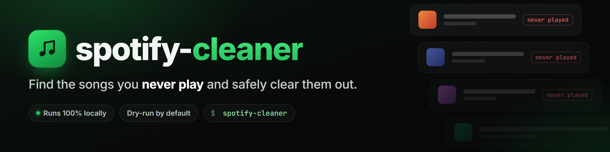
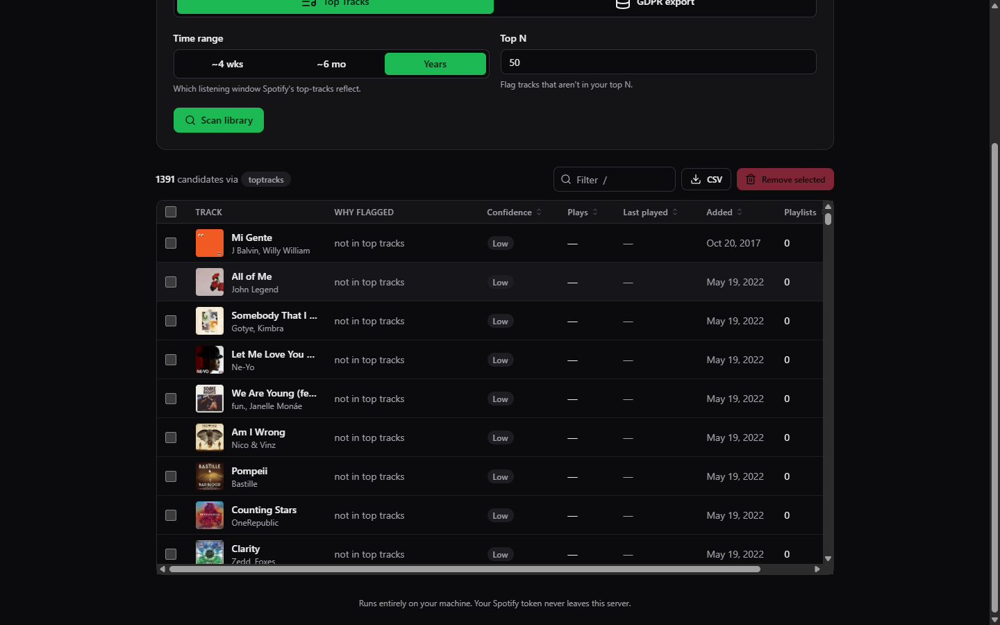
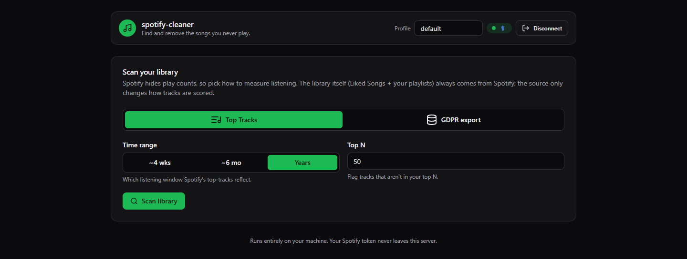
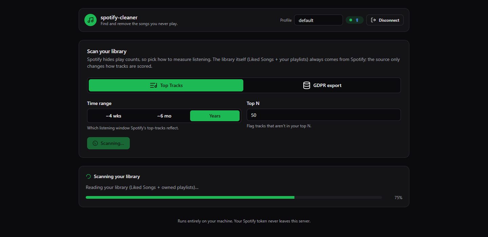
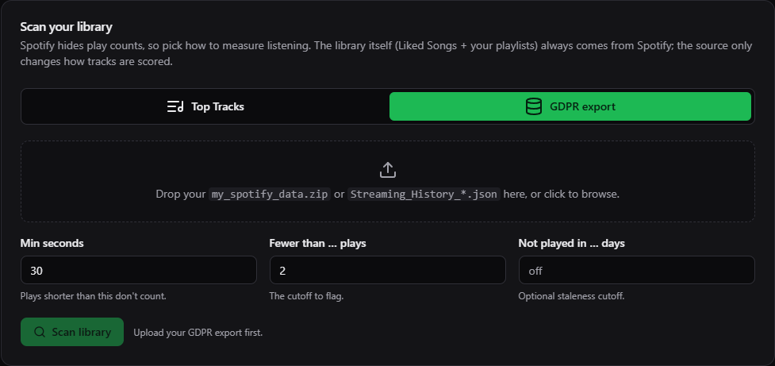
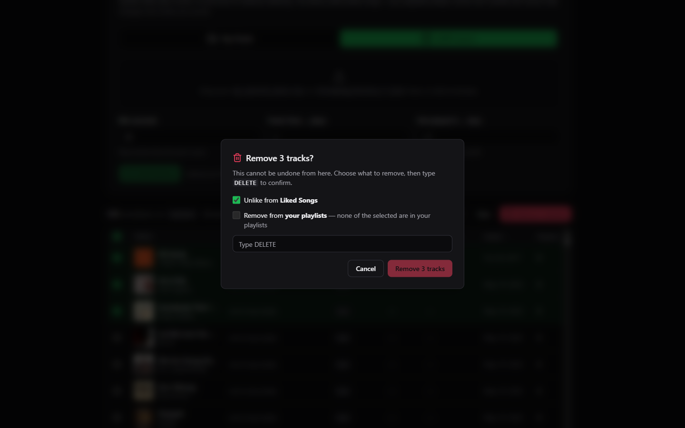
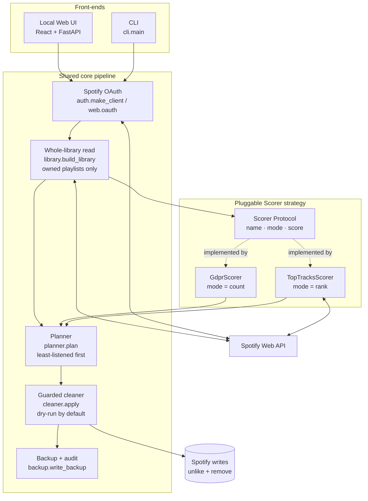
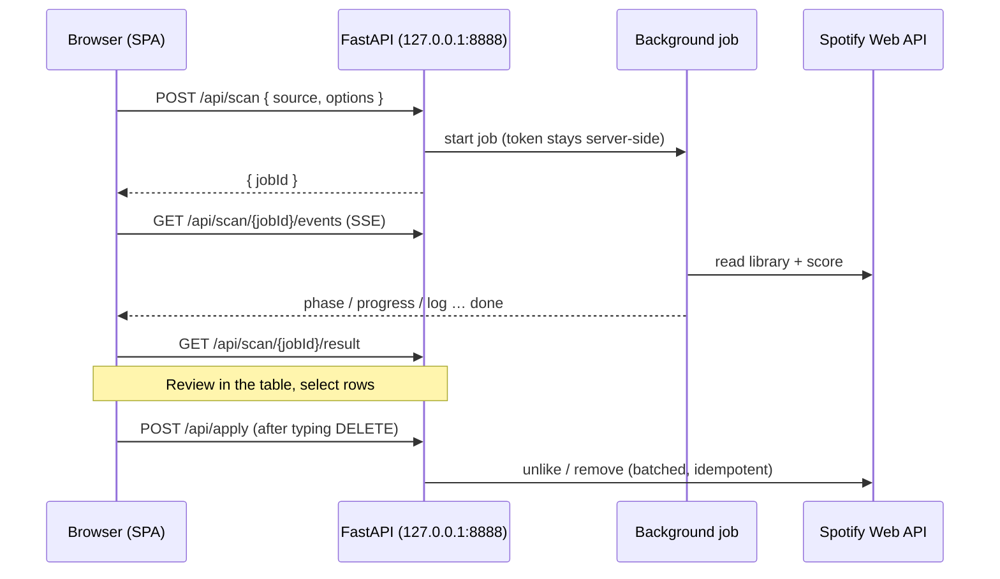

<!-- Banner is a generated asset (docs/banner.png), rendered at 2x for retina displays. -->
<p align="center">
  <a href="https://github.com/ron2k1/spotify-cleaner">
    
  </a>
</p>

<p align="center">
  <a href="https://github.com/ron2k1/spotify-cleaner/blob/main/LICENSE"></a>
  <a href="https://github.com/ron2k1/spotify-cleaner/actions/workflows/ci.yml"></a>
  <a href="https://github.com/ron2k1/spotify-cleaner/blob/main/pyproject.toml"></a>
  <a href="https://github.com/ron2k1/spotify-cleaner/blob/main/CONTRIBUTING.md"></a>
</p>

Find the songs you barely listen to and clear them out of your Liked Songs and
playlists. Works from a **CLI** or a small **local web UI**, with a hard dry-run
default so nothing leaves your library by accident.

Anyone can run this: you create your own free Spotify app (one dashboard click),
paste the two credentials into `.env`, and the tool talks only to your account.
Your login token stays on your machine in a gitignored cache. Nobody else, including
this project, ever sees it.

<p align="center">
  
</p>
<p align="center"><sub>The local web UI: every candidate in a sortable, filterable table. Review, then remove behind a typed-<code>DELETE</code> guard.</sub></p>

## Contents

- [The one thing you need to know first](#the-one-thing-you-need-to-know-first)
- [Highlights](#highlights)
- [Install](#install)
- [Use (CLI)](#use)
- [Web app (a local UI)](#web-app-a-local-ui)
- [Architecture](#architecture)
- [Cleaning up for a friend](#cleaning-up-for-a-friend-even-a-non-technical-one)
- [Getting the GDPR export](#getting-the-gdpr-export-the-accurate-source)
- [Safety](#safety)
- [Develop](#develop)
- [License](#license)

## The one thing you need to know first

**Spotify's API does not expose your personal play counts.** Your desktop app
shows them; the API hides them. So "least listened" has to come from one of
two sources, and you pick which one:

| `--source`   | True play counts?      | Setup                                   | Best for |
|--------------|------------------------|-----------------------------------------|----------|
| `toptracks`  | No (top-50 vs not)     | none                                    | a fast first pass right now |
| `gdpr`       | Yes (lifetime + dates) | request your data export, wait a bit    | the real, accurate cleanup |

The reading and removing machinery is identical for both. Only the
score source differs. That is the `Scorer` strategy you select.

## Highlights

- 🔒 **Local and private.** Talks only to your account; your token never leaves your machine.
- 🧹 **Two ways to measure "least listened".** Zero-setup `toptracks`, or true lifetime counts from your `gdpr` export.
- 🖥️ **CLI *and* a local web UI.** Same engine, same safety, pick whichever you prefer.
- 🛟 **Dry-run by default.** A real delete needs `--apply` *and* typing `DELETE`.
- ♻️ **Idempotent and resumable.** Interrupted mid-run? Re-run the exact command; already-removed tracks are skipped.
- 🧪 **Pure logic, unit-tested.** The planner and GDPR parser are tested without ever touching an account.

## Install

```bash
cd spotify-cleaner
python -m venv .venv
.venv\Scripts\activate            # Windows;  source .venv/bin/activate on macOS/Linux
pip install -e .
cp .env.example .env              # then fill in your Spotify app credentials
```

Create a Spotify app at <https://developer.spotify.com/dashboard>, and add the
redirect URI `http://127.0.0.1:8888/callback` exactly. Your developer account
must be Premium (a 2026 dev-mode requirement).

## Use

Everything is a **dry run by default**: it only prints candidates. Nothing is
deleted unless you pass `--apply` *and* type `DELETE` at the prompt.

```bash
# Zero-setup first look: tracks that aren't in your all-time top tracks
spotify-cleaner --source toptracks

# The accurate version, once your export has arrived (see below)
spotify-cleaner --source gdpr --gdpr-dir ./streaming_history --min-plays 1 --stale-days 365

# Actually remove them (asks for confirmation):
spotify-cleaner --source gdpr --gdpr-dir ./streaming_history --min-plays 1 \
    --apply --unlike --remove-from-playlists
```

Every scan covers your whole library: Liked Songs **and** every playlist you
own. Useful flags: `--limit N` (how many to print), `--time-range
short_term|medium_term|long_term`.

## Web app (a local UI)

Prefer clicking to typing? There's a small local web UI that does everything
the CLI does: pick a source, scan, eyeball the candidates in a sortable table,
select what to drop, and apply behind the same typed-`DELETE` guard. It can also
take a GDPR export by drag-and-drop instead of `--gdpr-dir`.

It runs entirely on your machine, on the **same origin as the OAuth redirect**
(`127.0.0.1:8888`). Your token never leaves localhost, the browser never sees
your client secret, and there's no CORS to configure.

<table>
  <tr>
    <td width="50%" valign="top">
      
      <br><sub><b>1. Pick a source and scan.</b> Top Tracks needs zero setup; GDPR is the accurate one.</sub>
    </td>
    <td width="50%" valign="top">
      
      <br><sub><b>2. Watch it work.</b> Progress streams live over Server-Sent Events as it reads your library.</sub>
    </td>
  </tr>
  <tr>
    <td width="50%" valign="top">
      
      <br><sub><b>GDPR mode.</b> Drop your export folder or zip (no <code>--gdpr-dir</code> needed) and set the play/staleness cutoffs.</sub>
    </td>
    <td width="50%" valign="top">
      
      <br><sub><b>3. The guard.</b> Choose what to remove, type <code>DELETE</code>. Nothing happens until you do.</sub>
    </td>
  </tr>
</table>

Build the UI once, then start the server:

```bash
cd frontend
npm install
npm run build          # bundles into src/spotify_cleaner/web/static/
cd ..
pip install -e ".[web]"
python -m spotify_cleaner.web   # opens http://127.0.0.1:8888
```

After `pip install -e ".[web]"` you can also just run `spotify-cleaner-web`.

For UI work, run `npm run dev` instead (Vite on `:5173`, proxying the API to
`:8888`) so changes hot-reload without a rebuild.

The table shows each candidate's **confidence** (how much to trust the verdict
for that source), lets you **filter** as you type (press `/` to focus the box),
and **exports to CSV** for review in a spreadsheet. Album thumbnails come from
Spotify's public oEmbed endpoint (no API key, fetched lazily and proxied so the
browser sees no third-party request); the handful of tracks it has no thumbnail
for fall back to a placeholder icon, and nothing else is affected.

## Architecture

The CLI and the web UI are two front-ends over one shared core. Both authorize
with Spotify, read your whole library, score it through a pluggable strategy,
and remove tracks behind the same guards. **The only thing that differs between
`toptracks` and `gdpr` is the scorer**. Everything downstream is identical.



| Stage | Module | What it does |
| --- | --- | --- |
| **Auth** | `auth.make_client` · `web.oauth` | Spotify OAuth; the token is cached locally (`.cache-spotify`), one cache per `--profile`. |
| **Read** | `library.build_library` | Reads your whole library: Liked Songs + every playlist **you own**. |
| **Score** | `scoring/` (`base`, `toptracks`, `gdpr`) | The pluggable `Scorer` strategy, the only piece that changes between sources. |
| **Plan** | `planner.plan` | Pure, fully-tested candidacy logic; least-listened first. Never touches the network. |
| **Clean** | `cleaner.apply` | Guarded, idempotent, batched removals. Dry-run unless `--apply`. |
| **Backup** | `backup.write_backup` | Records a manifest of everything it touches. |

**The `Scorer` strategy.** A scorer is a tiny `Protocol` (`scoring/base.py`): a
`name`, a `mode` (`count` or `rank`), and one method: `score(tracks)` returning
`{track_id: PlayStats}`. Adding a new "least-listened" signal means writing one
class and registering it in `cli._build_scorer`. The planner only ever sees
`PlayStats`, so it never needs to know where the numbers came from. That is
exactly why the two sources share the whole read → plan → clean pipeline.

**Web request flow.** The web UI is a same-origin SPA: the OAuth token is cached
server-side and never reaches the browser. Long operations run as background
jobs and stream progress over Server-Sent Events.



## Cleaning up for a friend (even a non-technical one)

Your friends do **not** need their own "API key." A Client ID/Secret identifies
the *app*, not the person. You make it once, and it's yours. A friend only ever
**logs into their own Spotify and clicks Agree**, which lets your app see *their*
library. Their token is the only per-person thing, and it stays on whichever
machine they authorized from.

A new Spotify app runs in **Development Mode**: only people you add by their
Spotify-account email under your app's **User Management** (in the dashboard) can
authorize it, up to **25 users**. "Me and my friends" fits inside that, so you
never need Spotify's public-app approval. Add each friend's email there first.

Then pick the path that matches the friend:

**A technical friend** runs the tool themselves. Cleanest: they create their own
free Spotify app (the same one-dashboard-click you did) so nothing is shared.
Their login never leaves their machine.

**A non-technical friend** can't install anything, so **you run it for them** on
your machine. Two flags make that safe:

```bash
# Authorize the friend once. --profile gives them their own token file so it
# never collides with yours; --no-browser prints a link instead of opening a
# browser, so they can approve on their own phone.
spotify-cleaner --source toptracks --profile alice --no-browser
```

The tool prints `Go to the following URL: …`. Text that link to your friend.
They open it (already logged into Spotify on their phone), tap **Agree**, and
land on a `http://127.0.0.1:8888/callback?...` page that won't load. That's
expected: they copy that URL from the address bar and send it back to you, you
paste it at the prompt, and their login is saved as `.cache-spotify-alice`. The
link only carries your public Client ID, never your secret.

After that, every run for that friend just reuses their cached login:

```bash
spotify-cleaner --source gdpr --gdpr-dir ./alice_history --profile alice \
    --min-plays 1 --apply --unlike --remove-from-playlists
```

Show them the dry-run list first, get their OK, then add `--apply`. They can
revoke your app any time at <https://www.spotify.com/account/apps/>.

## Getting the GDPR export (the accurate source)

1. <https://www.spotify.com/account/privacy/> → tick **only** "Extended
   streaming history" (not "Account data", which is just the last year).
2. Wait. Usually hours to a few days; Spotify quotes up to 30.
3. Unzip the email's download. Point `--gdpr-dir` at the folder of
   `Streaming_History_Audio_*.json` files.

It computes true lifetime play counts *and* last-played dates, so
`--min-plays` finds "added once, never played" and `--stale-days` finds
"used to love it, dead for years".

## Safety

- Dry run unless `--apply`; even then it requires typing `DELETE`.
- Only touches playlists **you own**.
- `--unlike` and `--remove-from-playlists` are independent opt-ins.
- Removed-from-playlist tracks are not deleted from Spotify; unliked tracks can
  be re-liked. Still: review the printed list before confirming.
- Every operation is idempotent. If a run is interrupted (network drop, rate
  limit), it prints how far it got. Just re-run the exact same command to
  finish. Already-removed tracks are skipped, so nothing is double-handled.

## Develop

```bash
pip install -e ".[dev]"
pytest                            # logic + parser tests, no account needed
```

Layout: `auth`/`library` (Spotify I/O) · `scoring/` (the pluggable sources) ·
`planner` (pure candidacy logic, fully tested) · `cleaner` (the guarded
deletes) · `cli` (wiring) · `web/` (FastAPI + the React SPA). See
[Architecture](#architecture) for how they fit together, and
[CONTRIBUTING.md](CONTRIBUTING.md) before opening a PR.

## License

MIT. See [LICENSE](LICENSE). Not affiliated with or endorsed by Spotify.
